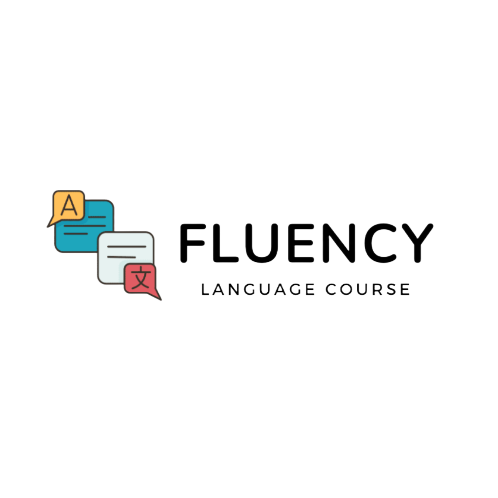

 

Fluency is an interactive web application designed to enhance language learning through engaging and intuitive interfaces. Our platform provides users with a variety of resources to improve their language skills effectively.

## Features

- **Reservation Sessions with Teachers**: Easily schedule one-on-one sessions with qualified language instructors to receive personalized guidance and support.

- **Discover a Variety of Teachers**: Browse through a diverse selection of teachers, each with unique teaching styles, specialties, and backgrounds. Get to know them through detailed profiles that showcase their qualifications and teaching philosophy.

- **Rate and Review Teachers**: After each session, provide feedback by rating your instructor. Share your experiences to help future learners make informed decisions.

- **View Your Booked and Completed Sessions**: Keep track of all your scheduled and past sessions in your profile. Easily manage your appointments and revisit past learning experiences.

- **Read Ratings and Reviews**: Access a comprehensive list of ratings and reviews for each teacher. This feature helps you choose the right instructor based on the experiences of other learners.
 **Multi-Language Support**: 
  - The application supports multiple languages, allowing users to learn and teach various languages seamlessly. This inclusivity broadens the platform's reach and appeal.

## Challenges

Developing the Fluency application presented several challenges that required innovative solutions:

- **User Experience Design**: Creating an intuitive and engaging user interface was crucial. We faced challenges in balancing aesthetics with functionality, ensuring that users could easily navigate the platform while enjoying a visually appealing design.

 **Feedback Mechanism**: Designing an effective system for users to rate and review instructors while preventing misuse or spam was a significant hurdle. We implemented moderation and validation processes to maintain the integrity of feedback.

##  Lessons Learned
- **Testing and Validation**: Implementing thorough testing procedures, including user testing and automated tests, helped us identify and resolve issues early, leading to a more reliable product.
- **Time Management**: Balancing feature development with testing and bug fixes taught us the importance of time management. Setting realistic deadlines and prioritizing tasks helped us stay on track.
## Resources

- **[Figma](https://www.figma.com/)**: A collaborative design tool that helped us create and iterate on UI/UX designs effectively.
- **[Stack Overflow](https://stackoverflow.com/)**: A valuable community for getting answers to coding questions and troubleshooting issues.
- **[W3Schools](https://www.w3schools.com/)**: A helpful site for learning web development basics, including HTML, CSS, and JavaScript.

  ## Color Reference

| Color             | Hex                                                                |
| ----------------- | ------------------------------------------------------------------ |
| Dark Navy         |  #0a192f   |
| Light Gray        |  #f8f8f8   |
| Teal              |  #00b48a   |
| Bright Teal       |  #00d1a0   |
| Black             |  #000000   |
| White             |  #FFFFFF   |
| Yellow            |  #FFD700   |
| Orange            |  #FFA500   |
| Purple            |  #800080   |
